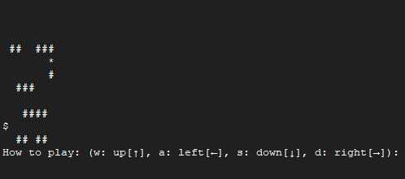

# 2D MIPS Console Game

A 2D console-based game written in MIPS assembly where the player navigates through an 8×8 map using WASD controls with the goal of reaching the exit.

Originally developed for **CS 350: Computer Organization and Assembly Language Programming**.



## Features

- Interactive player movement using WASD controls
- 8×8 console-rendered game map
- Dynamic player position tracking
- Obstacle collision detection
- Boundary checking to prevent invalid movement
- Exit detection and game termination
- Dynamic map reconstruction after each move
- Modular assembly routines for map rendering, initialization, input handling, movement, and game-state checks

## How It Works

The game stores the map as a 64-byte representation in memory, with each byte corresponding to one cell in the 8×8 map.

The program maintains the player's current row and column, calculates map positions using:

```text
offset = row × 8 + column
```

The map is rebuilt and displayed after each player action.

### Movement

The player moves using:

- `W` — Up
- `A` — Left
- `S` — Down
- `D` — Right

Before updating the player's position, the program checks whether the requested move would:

- Go outside the map boundaries
- Enter a wall or obstacle

Invalid moves are ignored and the player remains in the current position.

### Game State

The program tracks:

- Player X and Y coordinates
- Current game state
- Game-over status
- Score storage
- Static and dynamic map data

When the player reaches the exit gate (`*`), the game ends and displays a completion message.

## Implementation

The project is organized into several assembly routines, including:

- `initializeGame` — Initializes the game state and player position
- `parseMap` — Finds the player's starting position from the map data
- `displayCurrentMap` — Builds the current dynamic map
- `displayMap` — Renders the 8×8 map in the console
- `applyAction` — Processes keyboard input and player movement
- `CheckObstaclesAndBoundaries` — Prevents invalid movement
- `checkGameOver` — Detects when the player reaches the exit
- `printNewlines` — Refreshes the console display between turns

## Technologies

- MIPS Assembly
- Console I/O
- Memory addressing
- Registers and stack operations
- Branching and control flow
- System calls

## Running the Project

Run the assembly file using a MIPS simulator such as MARS.

1. Open the `.asm` file in MARS
2. Assemble the program
3. Run the program
4. Use `W`, `A`, `S`, and `D` to navigate the map
5. Reach the `*` exit to complete the game